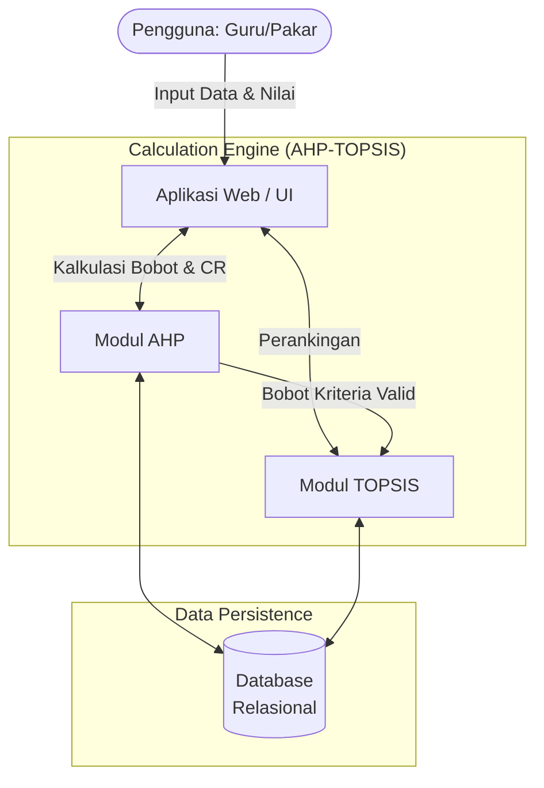
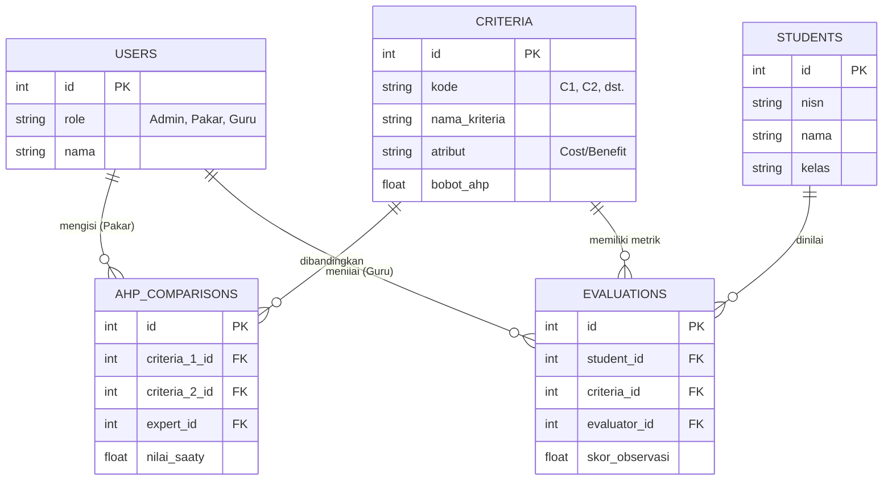

# Arsitektur dan Skema Sistem DSS AHP-TOPSIS

Dokumen ini memaparkan arsitektur komponen, alur kalkulasi algoritma hibrida (AHP dan TOPSIS), skema *database*, serta pemetaan desain teori ke dalam implementasi sistem evaluasi *soft skill*.

---

## 1. Diagram Arsitektur Komponen

Sistem Pendukung Keputusan (DSS) dirancang dengan memisahkan *layer* antarmuka, *layer* logika/kalkulasi, dan *layer* data.



**Penjelasan Komponen:**
- **Aplikasi Web / UI:** Antarmuka untuk *input* matriks perbandingan berpasangan (oleh pakar) dan *input* nilai observasi *soft skill* siswa (oleh guru).
- **Modul AHP:** Mesin penghitung prioritas bobot kriteria. Bertanggung jawab mengecek validitas subjektivitas pakar melalui *Consistency Ratio* (CR).
- **Modul TOPSIS:** Mesin perankingan yang mengambil bobot dari AHP dan menghitung kedekatan relatif setiap siswa (alternatif) terhadap solusi ideal.
- **Database Relasional:** Menyimpan data siswa, kriteria, matriks pakar, matriks evaluasi, dan rekam jejak hasil (log perankingan).

---

## 2. Alur Kalkulasi Algoritma (Flowchart)

Alur logika dari masuknya data hingga keluarnya peringkat akhir.

```mermaid
flowchart TD
    A([Mulai]) --> B[Input Matriks Perbandingan Kriteria oleh Pakar]
    B --> C[Kalkulasi Nilai Eigen & Bobot Kriteria AHP]
    C --> D[Hitung Consistency Ratio - CR]
    
    D --> E{Apakah CR <= 0.1?}
    E -- Tidak (Tidak Konsisten) --> F[Pakar Merevisi Input Matriks]
    F --> B
    
    E -- Ya (Konsisten) --> G[Simpan Bobot Kriteria]
    
    G --> H[Input Data Alternatif & Nilai Soft Skill Siswa]
    H --> I[Bentuk Matriks Keputusan]
    I --> J[Normalisasi Matriks TOPSIS]
    J --> K[Normalisasi Terbobot (Menggunakan Bobot AHP)]
    K --> L[Tentukan Solusi Ideal Positif & Negatif]
    L --> M[Hitung Jarak ke Solusi Ideal]
    M --> N[Hitung Kedekatan Relatif & Urutkan Peringkat]
    
    N --> O([Selesai / Tampilkan Ranking])
```

---

## 3. Skema Database (ERD)

Desain struktur tabel relasional utama untuk menyimpan instrumen dan data kalkulasi.



---

## 4. Pemetaan ke Implementasi Modul

Berdasarkan arsitektur di atas, algoritma dipetakan ke dalam implementasi program (sebagai referensi pengembangan):

### A. Modul AHP (`ahp_engine`)
- **Tugas:** Menarik data dari tabel `AHP_COMPARISONS`.
- **Fungsi Utama:** `calculate_eigen()`, `calculate_cr()`.
- **Kondisi Batas:** Jika `calculate_cr() > 0.1`, lemparkan pesan peringatan (*exception*) ke UI.
- **Output Akhir:** Memperbarui kolom `bobot_ahp` di tabel `CRITERIA`.

### B. Modul TOPSIS (`topsis_engine`)
- **Tugas:** Menarik data `STUDENTS`, matriks `EVALUATIONS`, dan parameter dari `CRITERIA` (`bobot_ahp` & jenis `atribut`).
- **Fungsi Utama:** `normalize_matrix()`, `weight_matrix()`, `calculate_distance()`, `calculate_preference()`.
- **Skenario Evaluasi Skalabilitas:** Modul inilah yang menjadi *bottleneck* utama ketika jumlah *students* (alternatif) >1000, sehingga optimasi fungsi matriks sangat krusial.
- **Output Akhir:** *Array / List* siswa yang telah diurutkan berdasarkan skor preferensi akhir.
