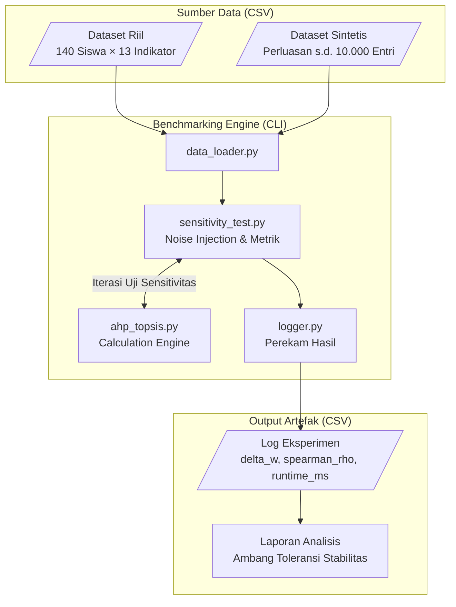
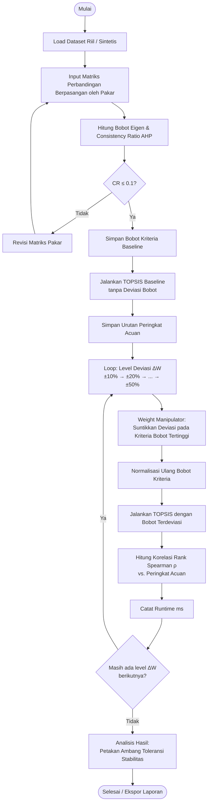

# Arsitektur dan Skema Instrumen — Benchmarking AHP-TOPSIS (Noise Injection)

Dokumen ini memaparkan arsitektur komponen skrip benchmarking, alur kalkulasi algoritma hibrida (AHP dan TOPSIS) beserta skenario **noise injection** untuk pengujian sensitivitas, skema struktur file CSV input/output, serta pemetaan desain teori ke dalam implementasi modul penelitian.

---

## 1. Diagram Arsitektur Komponen

Sistem terdiri dari dua *layer* utama: sistem operasional DSS dan instrumen eksperimen (skrip benchmarking). Dalam penelitian ini, fokus berada pada **Benchmarking Engine** sebagai instrumen pengujian ketangguhan algoritma.

---

## 2. Alur Kalkulasi Algoritma (Flowchart Lengkap)

Alur dari pembacaan data hingga pemetaan ambang batas toleransi stabilitas.

---

## 3. Skema Struktur Matriks Data (Input & Output)

Proyek ini mendasarkan perhitungannya pada matriks keputusan (tanpa database relasional). Berikut adalah struktur konseptual data yang diolah:

### A. Matriks Data Input Utama (Dataset Riil)

| Kolom | Tipe | Keterangan |
|-------|------|------------|
| `Alternatif` | string | Nama atau ID alternatif (contoh: Siswa-1) |
| `C11` – `C14` | float | Skor observasi Karakter / Kepribadian |
| `C21` – `C23` | float | Skor observasi Komunikasi |
| `C31` – `C33` | float | Skor observasi Kerjasama |
| `C41` – `C43` | float | Skor observasi Tanggung Jawab |

> Total: 13 kolom skor kriteria + 1 kolom identitas.

### B. Matriks Data Perluasan (Dataset Sintetis)

Format kolom sama seperti dataset riil, namun berisi hingga **10.000 baris** alternatif yang dibangkitkan secara terprogram untuk menguji performa beban (eksekusi matriks skala besar).

### C. Struktur Log Hasil Eksperimen

| Kolom | Tipe | Keterangan |
|-------|------|------------|
| `run_id` | int | Nomor iterasi eksperimen |
| `dataset_type` | string | `riil` atau `sintetis` |
| `n_alternatif` | int | Jumlah baris data yang diuji |
| `delta_w` | float | Tingkat deviasi bobot yang disuntikkan (0.0, 0.1, ..., 0.5) |
| `spearman_rho` | float | Koefisien korelasi Rank Spearman vs. baseline |
| `runtime_ms` | float | Waktu eksekusi algoritma end-to-end (ms) |

---
