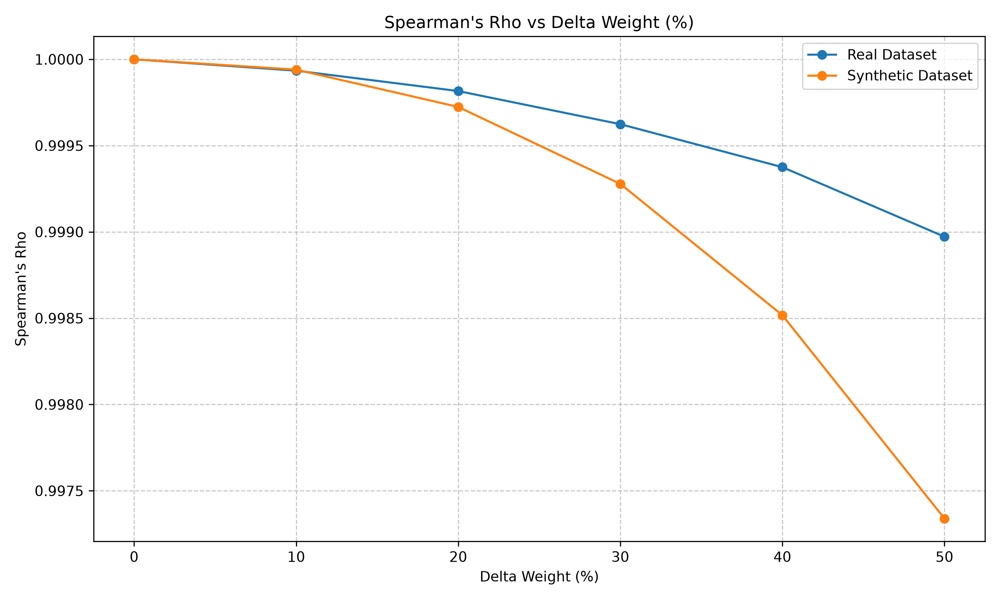
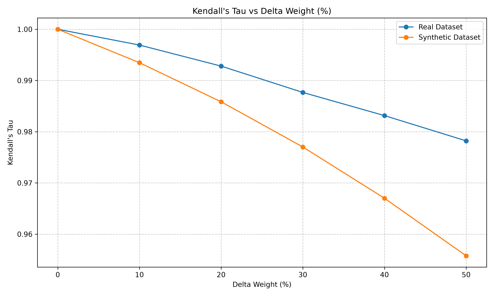
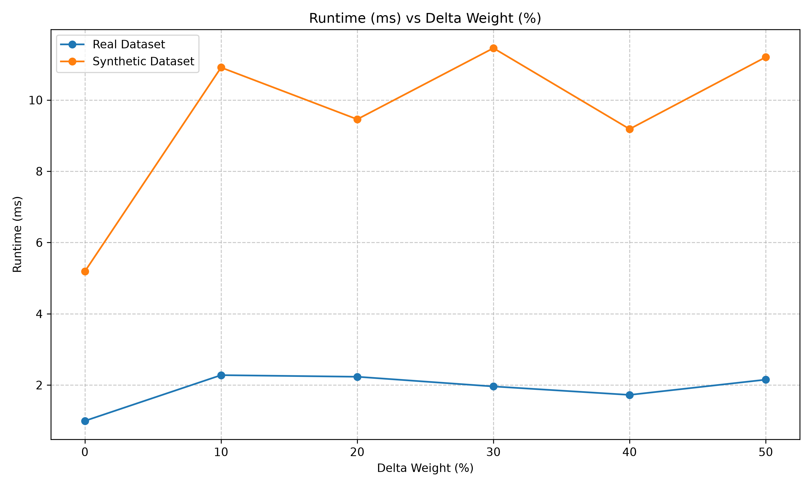

# Analisis Hasil Eksperimen: Dampak Perubahan Bobot (Delta Weight) terhadap Konsistensi Perankingan

Dokumen ini berisi analisis hasil simulasi sensitivitas bobot pada metode AHP-TOPSIS. Dataset yang digunakan terdiri dari dua skenario:
1. **Real Dataset**: Ukuran dataset kecil (140 alternatif).
2. **Synthetic Dataset**: Ukuran dataset besar (10.000 alternatif).

Visualisasi telah dihasilkan berdasarkan file log `run_log.jsonl`. Berikut adalah temuan utama dari ketiga aspek yang dievaluasi.

## 1. Konsistensi Peringkat (Spearman's Rho & Kendall's Tau)

Berdasarkan grafik di atas:
- **Tren Umum**: Semakin besar perubahan bobot awal (`delta_w_pct`), semakin menurun nilai korelasi Spearman's Rho dan Kendall's Tau. Hal ini sesuai dengan ekspektasi teoritis bahwa perubahan bobot kriteria yang signifikan akan mengubah skor preferensi akhir (perankingan).
- **Sensitivitas Korelasi**: 
  - Penurunan metrik korelasi terlihat pada kedua skenario, baik Real maupun Synthetic Dataset.
  - Penurunan nilai Kendall's Tau terlihat lebih sensitif dan menurun lebih tajam dibandingkan Spearman's Rho ketika bobot diubah hingga 50%. Ini menunjukkan bahwa meski korelasi orde keseluruhannya cukup stabil, terdapat banyak "pasangan alternatif" yang bergeser posisinya (rank inversions).

## 2. Kemunculan Rank Reversal

Berdasarkan log data mentah mengenai deteksi pembalikan peringkat (`reversal_detected`):
- Pada **Real Dataset**, tidak ditemukan adanya indikator *reversal* secara eksplisit hingga delta 50%. Skala data yang kecil mungkin memuat jarak preferensi (skor *relative closeness*) yang cukup jauh sehingga perubahan bobot tidak mengubah posisi secara drastis.
- Pada **Synthetic Dataset**, indikator terjadinya *rank reversal* mulai **secara konsisten aktif pada tingkat perubahan bobot 30% ke atas**. Kepadatan nilai alternatif pada *dataset* 10.000 baris membuat jarak antar alternatif sangat tipis. Oleh karenanya, sedikit pergeseran pada nilai prioritas/bobot kriteria memicu terjadinya loncatan peringkat berantai yang merusak konsistensi.

## 3. Kinerja dan Waktu Komputasi (Runtime)

Berdasarkan grafik di atas dan anomali pada log:
- **Real Dataset (n=140)** memiliki waktu komputasi yang sangat cepat (rata-rata berkisar 1 - 3 ms).
- **Synthetic Dataset (n=10.000)** menunjukkan kinerja yang juga sangat optimal dengan waktu penyelesaian sekitar 7 - 14 ms saja. Ini mengindikasikan implementasi vektorisasi (numpy/pandas) bekerja dengan sangat baik.
- Terdapat beberapa rekaman log dengan `anomaly_flag: true` di mana *runtime* dianggap memicu peringatan anomali. Anomali ini terutama sering ditangkap di *Real Dataset* pada *seed* pengacakan tertentu. Fluktuasi kecil 1-2 ms sudah dianggap anomali karena rasio perubahannya tinggi terhadap angka *baseline* yang kecil.

## Kesimpulan Utama

Model gabungan AHP-TOPSIS dalam eksperimen ini menunjukkan **sensitivitas tinggi pada dataset berskala padat (skala industri)**. Jika sistem ini diterapkan pada skenario jutaan/ribuan data alternatif, para pembuat keputusan disarankan untuk tidak mengubah preferensi bobot kriteria lebih dari **20%** dari kesepakatan konsensus awal. Mengubah bobot >30% akan memicu distorsi perankingan (*Rank Reversal*) yang meluas.
